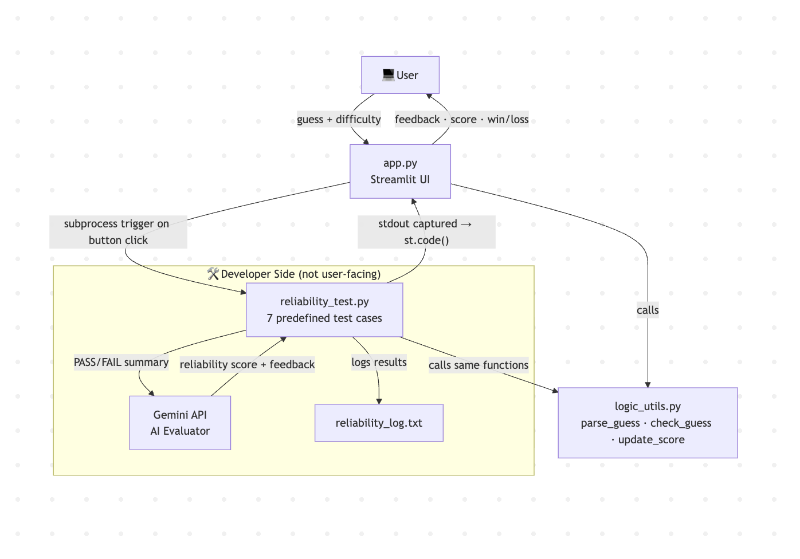

# 🎮 Game Glitch Investigator

> An AI-augmented number guessing game with automated reliability testing.

## 📌 Base Project
This project extends the Game Glitch Investigator system which was a buggy AI-generated number guessing game. The original app contained intentional bugs such as incorrect attempt tracking, broken buttons, and a scoring function that rewarded incorrect guesses. My role for the project was to manually test the app, identify bugs, and use AI tools such as Claude Code and ChatGPT to implement the fixes and tests. 

This final version of the Game Glitch Investigator system takes the debugged prototype and extends in into a full applied AI system by adding AI-powered reliability evalutation using the Gemini API.

---

## 🧠 What This Project Does

Game Glitch Investigator is a number guessing game where players try to guess a secret number within a limited number of attempts. Players can change the difficulty level as well as receive hints after each guess to try to guess the number correctly. What makes it an AI system is the reliability tesing layer. Developers can run a suite of predefined tests against the core game logic. Those test results are sent to Google Gemini which evaluates the results, flags any failures, assigns an overall reliability score, and recommends improvements. 

**Why it matters**: This demonstrates a real-world pattern used in software teams through AI-assisted QA and code evaluation.

## 🏗️ Architecture Overview


## ⚙️ Setup Instructions

### Prerequisites
- Python 3.9+
- Google Gemini API key

### 1. Clone the repository
```
git clone https://github.com/USERNAME/applied-ai-system-project.git
cd applied-ai-system-project
```

### 2. Install dependencies
```
python -m pip install -r requirements.txt
```

### 3. Set up your API key
Create a `.env` file in the project root:  
```
GEMINI_API_KEY=your_api_key_here
```

### 4. Run the app
```
streamlit run app.py
```

### 5. Run reliability tests (standalone)
```
python reliability_test.py  
```

*Note: If you would like the run it in the app, there is a button in the UI designated for it.*

## 💬 Sample Interactions
### Example 1 — Correct Guess (Won Game)
**Input**: Player guesses `17`, secret number is `17`
**Output**: 
```
You won! The secret was 17. Final score: 90
🎉 Correct!
[ballons animations]
```

### Example 2 — Wrong Guess with Hint
**Input**: Player guesses `50`, secret number is `81`
**Output**: 
```
📈 Go HIGHER!
```

### Example 3 — Wrong Guess (Lost Game)
**Input**: Player continuously guesses the incorrect number.
**Output**: 
```
Out of attempts! The secret was 66. Score: -25
Game over. Start a new game to try again.
```

*Note: The score depends on the difficulty level and the number of attempts the player takes.*

### Example 3 — Reliability Tester (AI Evaluation)
**Input**: Player clicks "Run Reliability Tests"
**Output**: 
```
⏳ Sending results to Gemini for evaluation...

===== GEMINI RELIABILITY REPORT =====
Here's an evaluation of the test results:

1.  **Are the results correct and consistent?**
    Yes, all tests passed, and the `expected` and `got` values match for each result, indicating correctness and consistency within the run tests.

2.  **Are there any concerning failures?**
    No, there are no failures reported among the provided test results. All tests passed.

3.  **Give an overall reliability score from 0.0 to 1.0 as a percentage.**
    1.0 (100%) based on the provided test results, as all executed tests passed successfully.

4.  **Give a short recommendation for improvement.**
    Expand test coverage to include edge cases for input (e.g., minimum/maximum allowed numbers, empty string, non-numeric characters in a valid range), multi-attempt game flows, and more comprehensive scoring scenarios (e.g., score after multiple correct/incorrect guesses, game over conditions).

===== TEST SUMMARY =====
[PASS] Correct guess should be a win
[PASS] Guess too high should return Too High
[PASS] Guess too low should return Too Low
[PASS] Valid number string should parse correctly
[PASS] Non-number guess should fail to parse
[PASS] Win on first attempt should score 90
[PASS] Wrong guess Too Low should deduct 5 points

7/7 tests passed
```

## 🔧 Design Decisions
- **Separating logic into `logic_utils.py`**: The original project had all logic inside `app.py`. Extracting it into a separate module made the code better organized and testable without running Streamlit, which was essential for the reliability tester.   
- **Using `session_state` for all game data**: Streamlit reruns the entire script on every interaction. Without carefully storing state (attemps, score, feedback, status), values would reset unpredictably which was the root cause of many of the bugs in the app.
- **Calling `st.rerun()` after every guess**: Streamlit renders UI top to bottom before state updates are complete. This means that before the "Attempts left" counter would always display one step behind the actual count.
- **AI evaluation via Gemini**: Rather than just printing out test results, the Gemini API was integrated to give more detailed insight. Plain pass/fail outputs show *what* failed but not *why*. Routing the results through Gemini adds an interpretive layer that mirrors how a developer might review a test report.
**Trade-off**: [NEED TO EXPLAIN MORE]

## 🧪 Testing Summary
The most significant failures *before* fixes: 
- The secret number kept changing between an integer and a string on every attempt. This was also caught by the test cases and was fixed by removing the condition in `app.py` that was causing this issue.
- `update_score()` was adding points on "Too High" guesses on every other attempt. This was caught by the test cases and was fixed in `logic_tils.py` by deducting points whenever the player gueses a number that was too high.

Once all logic fixes have been made to the functions, Gemini's reliability score was 100%, however the AI provided useful recommendations for future enhancements such as handling edge cases for input parsing.

## 💭 Reflection
**What are the limitations or biases in your system?**
The game logic is well-tested, but the AI evaluation layer (Gemini) introduces variability. The same test results can produce slightly different wording or scores across runs because language models are non-deterministic. The reliability score is a useful signal but not a precise measurement. It is important to conduct further testing with many test cases as well as edge cases to thouroughly test the system.

**Could your AI be misused, and how would you prevent that?**
In this project, the AI only receives test result summaries, no user data or game state. The prompt is also fully controlled by the developer, so there is minimal risk of AI misuse. If the system is extended to accept user provided input in the prompt, further precautions such as cleaning the input would need to be taken. 

**What surprised you while testing reliability?**
What surprised me while testing reliability was that all 7 tests passed on the first run. Since I had already debugged the game logic in the base project, the test suite confirmed the fixes held up rather than revealing new problems. It made me appreciate that reliability testing is not just for finding bugs but also to prove that the code works after changes which is just as valuable.

**AI Collaboration**
The most helpful suggestion Claude gave was when it recommended adding `st.rerun()` after each guess submission as well as storing all messages in the `session_state`. This was not obvious just from looking at the code and manually testing the app, but it proved to be a crticial component in accurately rendering the correct number of attempts and all of the feedback messages for the player.   

One instance where Claude Code's suggestion was flawed was when it was recommending refactoring many lines of code to fix the incorrect decrementation of the attempt counter. The code seemed overly complex for what seemed to be a simple issue, so I rejected it. Instead, I switched to Claude and uploaded screenshots of my UI to give it a better visual context of the problem. With a clearer description and visual evidence, it was able to identify the fix within a few lines of code. Those changes also proved to be helpful for future errors as well as it had to do with `session_state`.  

